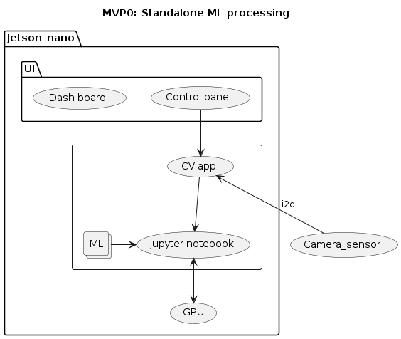
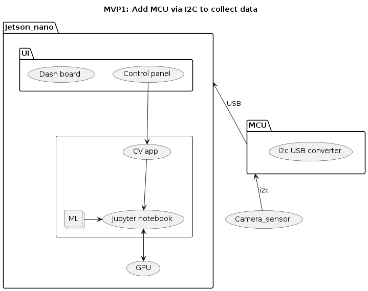
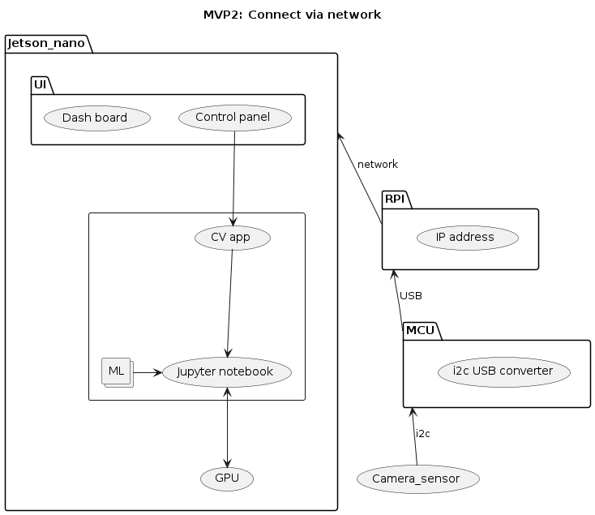
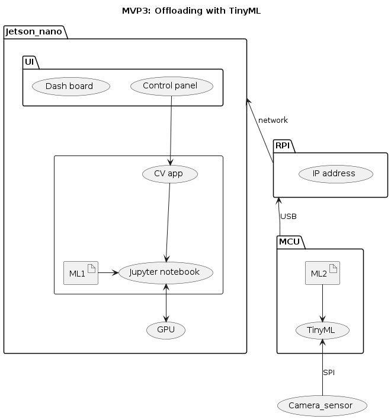
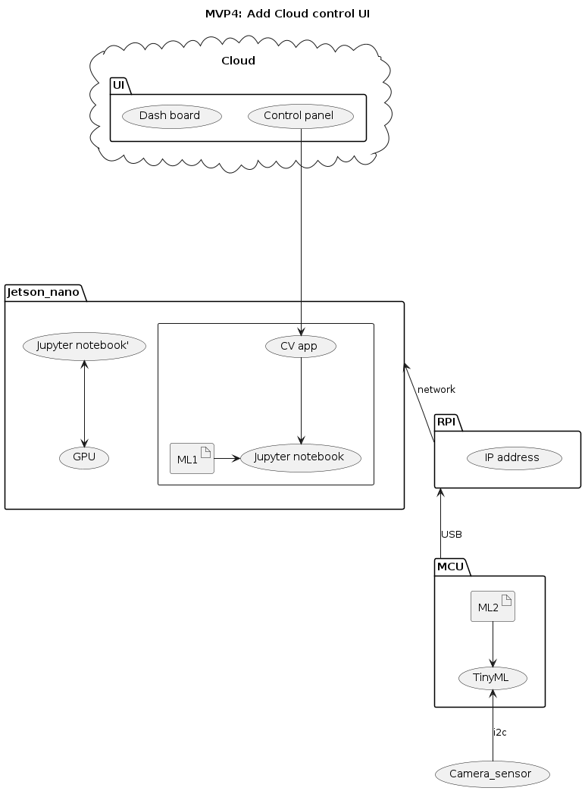
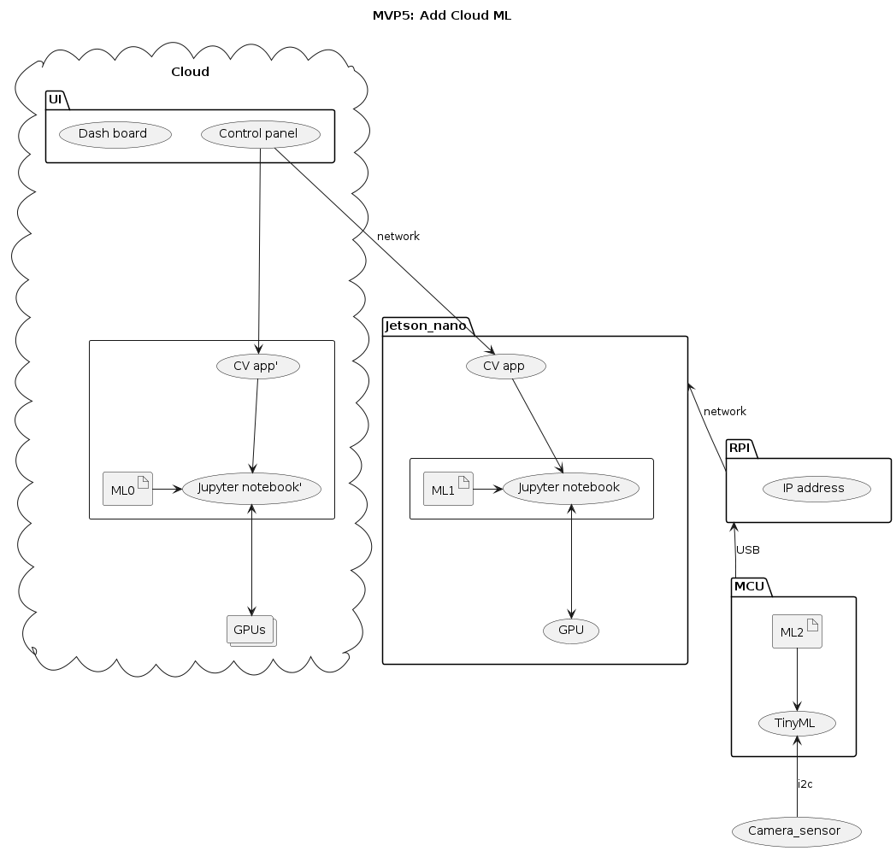
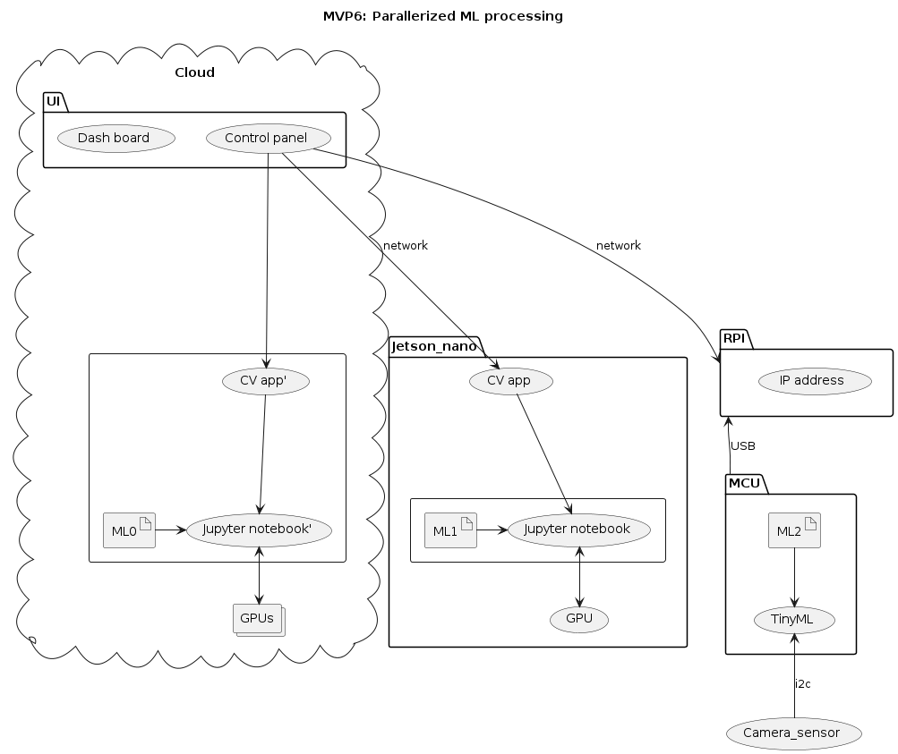
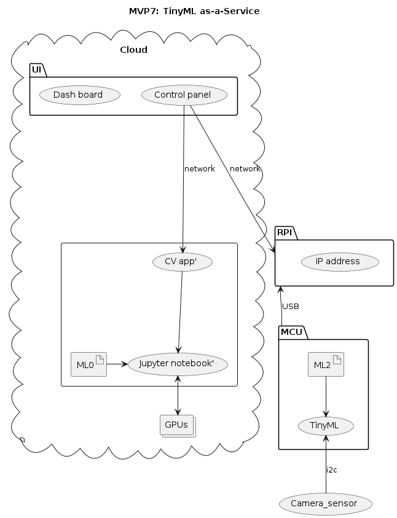

# Basic info (1/2)
- Here's the original [announcement](https://study.cs.helsinki.fi/projekti/topics/create)
- Here's our proposal, [Seamless TinyML lifecycle management](https://github.com/Origami-TinyML/software-engineering-project/blob/main/soft_eng_proj_tinyml_lifecycle.md)
- 5 students are assigned to our project.
- 15 working hours / week / student is expected.
- The project duration, 14 weeks (week 3-16), is scheduled.
  * 15 hours * 14 weeks * 5 students
  * = 1050 hours / 7.5 hour
  * = 140 man days / 22
  * = 6.4 man month

# Basic info (2/2)

## Milestone
    1. Around week 9.
    2. Around week 13.

## Project duration:
    1. Originally, 14 weeks, week 3-16
    2. Preferably, 12 weeks, week 3-14
    3. Ideally, 10 weeks, week 3-12

## Weekly work hours
  - 15 hours * 14 weeks = 210 hours
    1. Originally, 210 hours / 14 weeks = 15 hours/week
    2. Preferably, 210 hours / 12 weeks = 17.5 hours/week
    3. Ideally, 210 hours / 10 weeks = 21 hours/week

Can UI (Dashboard & Control panel) parts be prioritized to meet some milestones?

# Project goal (1/2)

To make things easier, it is recommended that the students start familiarizing with the different concepts of [Machine Learning (ML) lifecycle](https://www.datacamp.com/blog/machine-learning-lifecycle-explained).
Also, prior jumping in the implementation of the lifecycle management of TinyML-tailored models, it is perhaps a good idea start implementing/executing some of the steps of the original project proposal (e.g., step 2, step 3, step 5, step 6) in a more resourceful computing environment than a microcontroller (MCU). For example, the students could use their own laptop, a cloud environment, or Single-Board Computer (e.g., [Jetson Nano](https://developer.nvidia.com/embedded/jetson-nano-developer-kit))
<!---
We will reproduce [Roberto's demo video](https://youtu.be/xYntGeLmCSI), adding its ML training phase, along with TinyML MCU.
-->

The following demos/tutorials can provide an high-level overview on how to deploy the above mentioned steps:

1. [Jetson Nano Custom Object Detection - how to train your own AI](https://www.youtube.com/watch?v=kJpLMBqNcIQ&ab_channel=KevinMcAleer)
2. [Jetson AI Fundamentals - S3E4 - Object Detection Inference](https://www.youtube.com/watch?v=obt60r8ZeB0&list=PL5B692fm6--uQRRDTPsJDp4o0xbzkoyf8&index=12&ab_channel=NVIDIADeveloper)
3. [Jetson AI Fundamentals - S3E5 - Training Object Detection Models](https://www.youtube.com/watch?v=2XMkPW_sIGg&ab_channel=NVIDIADeveloper)

Please note that online it is possible to find plenty of tutorials/demos that can help you on deploying the ML lifecycle management for such resourceful computing environments. Feel also free to reach out to us for asking additional references.

As for the dashboard/user interface deployment, here are a few minimalistic examples and references that can help but feel free to be fancy as you like:

1. [Explainer Dashboard — Build interactive dashboards for Machine learning models](https://medium.com/analytics-vidhya/explainer-dashboard-build-interactive-dashboards-for-machine-learning-models-fda63e0eab9)
2. [Model Monitoring Dashboards made easy](https://pub.towardsai.net/model-monitoring-dashboards-made-easy-1-3-471b94313b5f)
3. [Building MLGUI, user interfaces for machine learning applications](https://venturebeat.com/ai/building-mlgui-user-interfaces-for-machine-learning-applications/)
 
While these demos uses relatively large hardware which may not belong to TinyML strictly (e.g. TinyML should run on RTOS but not on Linux),
we are gradually migrating to TinyML MCUs. There are 4 benefits of starting with the original setting:

1. Jetson nano is a standalone GPU, where we run the following app locally at once before starting pipe-lining on other nodes.
   - Computer Vision apps, inc. ML models
   - dashboard on a web server
   - Jupyter notebook

# Project goal (2/2)
2. We could learn from Jetson nano mature tool-stack what kind of tool-stack is still missing to implement TinyMLaaS.
3. We could start with this existing demo immediately with runnable CI, and
4. We are polishing it more fancy gradually towards TinyML as-a-Service.
4. We could gradually migrating to TinyML by adding or replacing a node one by one.
   - For example, we could replace the data acquisition node with:
     a. Camera sensor + Arduino Nano 33 BLE Sense + RPI (for IP)
     b. Camera sensor + RPI pico with WiFi

Although Our final goal is to run ML on a mirocontrooler node,
it's better to start with the safer configuration at first.

# MVP journey
We should always have a runnable MVP automatically generated by CI/CD at every Sprint (or PR).

{height=80%}

# MVP0
::: columns
:::: {.column width=50%}
Jetson nano is almost a laptop with GPU so that everything should work standalone.

## ML pipeline
1. Object detection
2. -> face detection
3. -> Person identification pipeline

A VM can be used to test the similar functionality with mock camera.
::::
:::: {.column width=50%}

::::
:::

# MVP0 -> MVP1
::: columns
:::: {.column width=50%}

::::
:::: {.column width=50%}
{height=100%}
::::
:::
At first, we could push sensor part out via USB.

# MVP1 -> MVP2
::: columns
:::: {.column width=50%}
{height=100%}
::::
:::: {.column width=50%}
{height=100%}
::::
:::
To orchestrate ML, IP connection is convenient so that we insert RPI between Jetson and MCU.

# MVP2 -> MVP3
::: columns
:::: {.column width=50%}
{height=100%}
::::
:::: {.column width=50%}
{height=85%}
::::
:::
Run a small part of ML processing (ML2) as TinyML on MCU.

# MVP3 -> MVP4
::: columns
:::: {.column width=50%}
{height=80%}
::::
:::: {.column width=50%}
{height=85%}
::::
:::
CLOUD'ification should be done earlier independently to meet early demo (between week 9 and week 13).

<!---
(e.g. MWC)
-->

# MVP4 -> MVP5
::: columns
:::: {.column width=50%}
{height=85%}
::::
:::: {.column width=50%}
{height=80%}
::::
:::
Run some part of ML processing (ML0) on Cloud.

# MVP5 -> MVP6
::: columns
:::: {.column width=50%}
{height=80%}
::::
:::: {.column width=50%}
{height=90%}
::::
:::
No cascading MLs but paralleling with nodes.

# MVP6 -> MVP7
::: columns
:::: {.column width=50%}
{height=100%}
::::
:::: {.column width=50%}
{height=80%}

Get rid of Jetson nano but only with TinyMLaaS.
::::
:::

# TDD / CI / CD / Acceptance test
::: columns
:::: {.column width=45%}
## How it works
1. Developer sends PR to repository
2. Kicked Github workflow (action)
3. Starts CI / CD
4. Run acceptance tests on 3 envs
   a. Container with **mock** Cam
   b. Jetson nano with **mock** Cam
   c. MCU with **mock** Cam
5. Merge Changes once all tests pass.
6. Store Artifacts
    - install-able images
7. Always Runnable system to demo
::::
:::: {.column width=55%}
{height=110%}
::::
:::

# Kick-off meeting Agenda (1/4)
Scheduled on 16th JAN (MON)

## Get familiar with all participants. Everyone introduces oneself
  1. What one can do
  2. What one wants to do
  3. How one sees this project

## Will explain [Project goal](#project-goal)
  - We should present [demo video 1](https://youtu.be/xYntGeLmCSI) & [demo video 2](https://www.youtube.com/watch?v=d37narobVG0)

# Kick-off meeting Agenda (2/4): SCRUM team

Role | Name | Note
:---|:---|:---
SM | [Michihito Mizutani](https://www.linkedin.com/in/michihito/) |
PO | [Roberto Morabito](https://www.linkedin.com/in/robertomorabito/) |
Developer | 5 students | names to fill here 
ML support | [Hiroshi Doyu](https://www.linkedin.com/in/hidoyu/) |
Customer | Perttu, Samuli | Review incremental

# Kick-off meeting Agenda (3/4)
## User story mapping
  - Specify PBIs always as GitHub issues, which need to be a PR and it automatically runs CI/CD as acceptance tests.
  - PBI == SBI?
  - Estimate PBI effort (PBI workload unit?)
  - Specify acceptance tests and implement in CI before implement features
  - the 1st increment == 1 sprint
  - For the rest, 1 increment == 2 sprint
  - 1st sprint planning should be done on 16th.

# Kick-off meeting Agenda (4/4)
## Agree on WoW in SCRUM
- Use Github project [KANBAN]()
- Use [Discord channel](https://discord.gg/kQD685q4) to communicate or Slack?
- Agree on scheduling a Daily meeting day & time
- 1 increment == 2 sprint
- 1st sprint should have some [Architecture investigation](#architecture-investigation) to find out which components are reusable.
- 1st sprint should have a ZFR (Zero Feature Release) to make sure that CI/CD works on Github workflow (action) without any features (or just with existing components)
- We should run CI/CD to reproduce the current Roberto's demo story at first, without a training part. If HW is not available, it could be simulated.

# Architecture investigation @Roberto?
- How should we understand Roberto's demo architecture?
  - Any architecture document?
  - Any architecture block diagram?
  - Any flow diagram?
  - Any list of components used? which could be reused and which not, since the outcome of this project would be opensource'ed.
  - Any list of software frameworks each components uses?
- Should we map each Seamless TinyML lifecycle management's phase on this demo scenario?
- Should we make sure which phases are still missing? (e.g. "2. Model training")

# Mapping 6 Seamless TinyML lifecycle to this project

Phase # | Name | Early phase | Demo
:---:|:---|:---|:---
1| Data collection | Simulated | RPI pico + Cam 
2| Model training | Missing | On Cloud VM?
3| Model squeezing | ML compiler | ML compiler 
4| Model splitting | Standalone |  Pipelining
5| Model deployment | Standalone | TBI
6| Model update | Dashboard | Control panel

# Remaining questions
- What's the main purpose of this project from students' perspective? (e.g. experience Agile development)
- How long can the 16th meeting be allocated? (e.g. 3-4 hours with lunch break)
- What kind of competency are students generally expected? (e.g. Python, JS, Java, Frontend, Embedded)
- Can student's weekly working hours be negotiable? (e.g. 15 hours with 14 weeks -> 17.5 hours with 12 weeks)

# Contact information
## [Origami](#Team)
[https://Origami-TinyML.github.io/blog/about.html](https://Origami-TinyML.github.io/blog/about.html)

