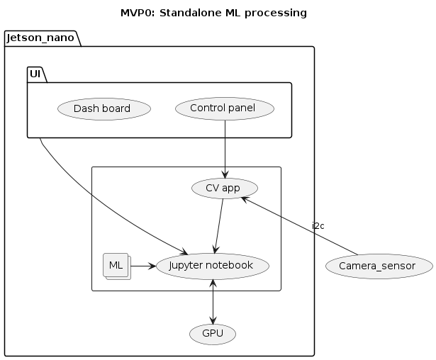

# Software Engineering Project in Helsinki University CS
- Here's the original [announcement](https://study.cs.helsinki.fi/projekti/topics/create)
- Here's [our proposal](https://github.com/Origami-TinyML/software-engineering-project/blob/main/soft_eng_proj_tinyml_lifecycle.md)
- 5 students are assigned to our project, no info for their skill level yet.
- 15 hours / week / student is expected.
- 14 weeks (week 3-16) is scheduled.
  - 15 hours * 14 weeks * 5 students == 1050 hours / 7.5 hour == 140 man days / 22 == 6.4 man month.
  - @Michi, which unit for SBI workload? (e.g. 3 hours, 7.5 hours or 15 hours)
- NEXUS Demo day is on 27th March on week 13 while MWC is on week 9 at the end of FEB.
  - week 3-16 == 14 weeks, originally
  - week 3-12 == 10 weeks, ideally
  - Should we ask to squash this by week 12 (10 weeks)?
    - 15 hours * 14 weeks == 210 hours
    - 210 hours == 15 hours/week, originally
    - 210 hours / 12 weeks == 17.5 hours/week
    - 210 hours / 10 weeks  == 21 hours/week, ideally

# Project goal
We will reproduce [Roberto's demo video](https://youtu.be/xYntGeLmCSI), adding its ML training phase, towards NEXUS Demo day (27th March).
While Roberto's demo uses relatively large hardware which may not belong to TinyML precisely (e.g. TinyML run on RTOS but not on Linux),
those hardware (e.g. Jetson nano) usually come with a mature ready-made tool-stack to run ML examples immediately.
There are 4 benefits of making use of Roberto's demo for this project.

1. Jetson nano is a standalone GPU, where we run the following app locally at once before starting pipeline of other nodes.
   - some computer vision app
   - dashboard on a webserver
   - jupyter notebook
2. We could learn from Jetson nano mature tool-stack what kind of tool-stack is still missing to implement TinyMLaaS in the future.
3. We could start with this existing demo immediately in CI and be polishing it more fancy gradually, aiming at investors attending NEXUS Demo day.
4. We could gradually migrating to TinyML by adding or replacing a note. For example, we could replace the data acquistion node with:
   - camera + Arduino Nano 33 BLE Sense + RPI (for IP)
   - camera + RPI pico with WiFi

Our final goal is to run ML on a mirocontrooler node but it's better to start with the safer configuration at first.

# Kick-off meeting
Scheduled on 16th JAN (MON)

## Agenda
- Get familiar with all participants.
  - Everyone introduces oneself
     - what he can do
     - what he wants to do
     - how he understand this project
- Explain the [Project goal](#project-goal)
  - We should present [demo video](https://youtu.be/xYntGeLmCSI).
- Set up a SCRUM team (e.g. specify each role in the project)
  - SM: Michi + a HU instructor
  - PO: Roberto
  - Developer: 5 students
  - ML: Hiroshi
  - Customer: Perttu & Samuli would review the outcome of increment in bi-weekly meeting.
- User story mapping
  - Specify PBIs always as GitHub issues, which need to be a PR and it automatically runs CI/CD as acceptance tests.
  - Estimate PBI effort
  - Specify acceptance tests
  - 1 increment == 2 sprint
- 1st sprint planning should be done on 16th.

## Agree on WoW in SCRUM
- Use Github project [KANBAN]()
- Use [Discord channel](https://discord.gg/kQD685q4) to communicate or Slack?
- Agree on scheduling a Daily meeting day & time
- 1 increment == 2 sprint
- 1st sprint should have some [Architecture investigation](#architecture-investigation) to find out which components are reusable.
- 1st sprint should have a ZFR (Zero Feature Release) to make sure that CI/CD works on Github workflow (action) without any features (or just with existing components)
- We should run CI/CD to reproduce the current Roberto's demo story at first, without a training part. If HW is not available, it could be simulated.

## Architecture investigation
- How should we understand Roberto's demo architecture?
  - Any architecture document?
  - Any architecture block diagram?
  - Any flow diagram?
  - Any list of components used? which could be reused and which not, since the outcome of this project would be opensource'ed.
  - Any list of software frameworks each components uses?
- Should we map each Seamless TinyML lifecycle management's phase on this demo scenario?
- Should we make sure which phases are still missing? (e.g. "2. Model training")

Phase # | Name | Early phase | Demo
:---:|:---|:---|:---
1| Data collection | Simulated | RPI pico + Cam 
2| Model training | Missing | On Cloud VM?
3| Model squeezing | ML compiler | ML compiler 
4| Model splitting | Standalone |  Pipelining
5| Model deployment | Standalone | TBI
6| Model update | Dashboard | Control panel

# Questions
- What's the main purpose of this project from students' perspective? (e.g. experience Agile development)
- How long can the 16th meeting be allocated? (e.g. 3-4 hours with lunch break)
- What kind of competency are students generally expected? (e.g. Python, JS, Java, Frontend, Embedded)
- Can student's weekly working hours be negotiable? (e.g. 15 hours with 14 weeks -> 17.5 hours with 12 weeks)