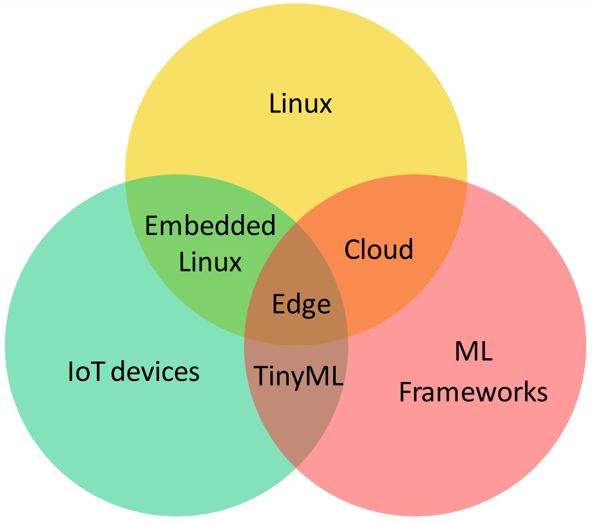
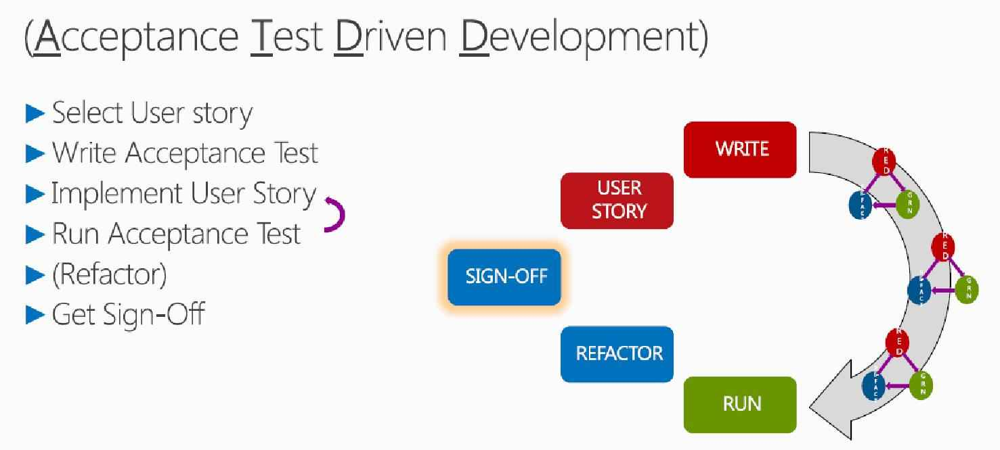

# Project goal
::: columns
:::: {.column width=55%}
_"The main goal of this software engineering project is to develop a solution that enables a seamless **TinyML lifecycle management**.
In particular, the idea is to build a framework that **in an automated fashion** performs the different steps of the TinyML lifecycle management."_

::::
:::: {.column width=45%}
{height=80%}
::::
:::

# Lifecycle: ML vs TinyML
::: columns
:::: {.column width=50%}
## Cloud & Edge ML
{height=100%}
::::
:::: {.column width=50%}
## TinyML
{height=80%}
::::
:::

# Arch: Edge ML vs Cloud ML vs TinyML
::: columns
:::: {.column width=30%}
## Edge ML
(Local ML)
{height=100%}
::::
:::: {.column width=30%}
## Cloud ML
{height=100%}
::::
:::: {.column width=40%}
## TinyML
{height=120%}
::::
:::

# MVP journey
::: columns
:::: {.column width=65%}
{width=100%}
::::
:::: {.column width=35%}
Acceptance Test Driven Development
{width=120%}
::::
:::

# CI / CD / ATDD
{height=95%}

# Contact information
## [Origami](#Team)
[https://Origami-TinyML.github.io/blog/about.html](https://Origami-TinyML.github.io/blog/about.html)
