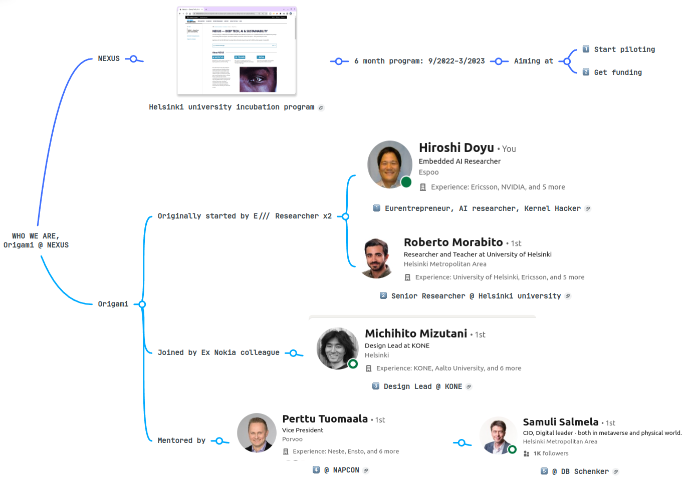

# Who we are, Origami[*](https://www.mindmeister.com/map/2547854225)
{height=100%}

# Project goal
::: columns
:::: {.column width=55%}
_"The main goal of this software engineering project is to develop a solution that enables a seamless **TinyML lifecycle management**.
In particular, the idea is to build a framework that **in an automated fashion** performs the different steps of the TinyML lifecycle management."_,

from [the original application](https://github.com/Origami-TinyML/software-engineering-project/blob/artifacts/soft_eng_proj_tinyml_lifecycle.md)

::::
:::: {.column width=45%}
{height=80%}
::::
:::

# Lifecycle of: ML vs TinyML
::: columns
:::: {.column width=50%}
## (Cloud) ML
{height=100%}
::::
:::: {.column width=50%}
## TinyML
{height=80%}
::::
:::

# Arch: Edge ML vs Cloud ML vs TinyML
::: columns
:::: {.column width=30%}
## Edge ML
(Local ML)
{height=100%}
::::
:::: {.column width=30%}
## Cloud ML
{height=100%}
::::
:::: {.column width=40%}
## TinyML
{height=120%}
::::
:::

# CI / CD / ATDD
{height=85%}

The simplest **Test1**: [_TFLite micro Hello World_](https://www.tensorflow.org/lite/microcontrollers#explore_the_examples) in x86 container w/o HW.

# MVP iteration
::: columns
:::: {.column width=65%}
## Always runnable MVP at Day 1
{width=80%}
::::
:::: {.column width=35%}
## Acceptance Test Driven Development
{width=120%}
::::
:::

# Automate with TinyML as-a-Service API
::: columns
:::: {.column width=60%}
## [OpenAPI](https://www.openapis.org/) spec for TinyMLaaS (Old)
{height=100%}
::::
:::: {.column width=40%}
## Function as-a-Service (FaaS)
{height=100%}
::::
:::
TinyMLaaS orchestrates TinyML on _**any IoT system**_.

# TensorFlow Lite for Microcontrollers[*](https://github.com/tensorflow/tflite-micro/tree/main/tensorflow/lite/micro/examples)
::: columns
:::: {.column width=20%}
## ML model Examples
{height=70%}
::::
:::: {.column width=50%}
{height=90%}
::::
:::: {.column width=30%}
## Face-Following Pan/Tilt Stand[*](https://www.hackster.io/petewarden/face-following-pan-tilt-stand-fe5da6)
{height=90%}
::::
:::

# User story
_As a [persona], I [want to], [so that]_

::: columns
:::: {.column width=50%}
- As a Data Scientist,
  - I want to collect data to train
    - I want to label data to train
  - I want to train models to use devices
  - I want to store models to assign
- As a on-site IT operator,
  - I want to register:
    - IoT devices to observe
    - models to update
    - toolchain to compile
  - I want control panel:
    - to assign models
    - to build ML pipelines
::::
:::: {.column width=50%}
- As a CFO,
  - I want to compare Cloud vs TinyML for cost
  - I want to pipeline Cloud & TinyML for flexibility
- As a CEO,
  - I want dashboard to observe devices
- As a CTO,
  - I want automated dry-run of a whole lifecycle to reject support requests

.... e.t.c
::::
:::

# Contact information
## [Origami](#Team)
[https://Origami-TinyML.github.io/blog/about.html](https://Origami-TinyML.github.io/blog/about.html)
