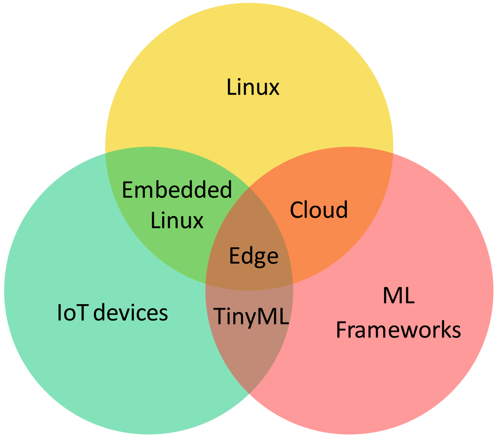
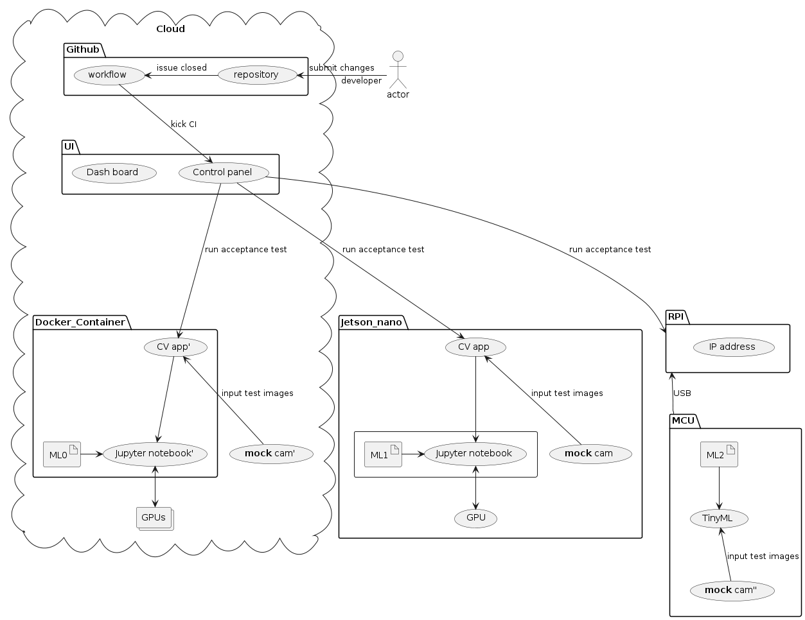
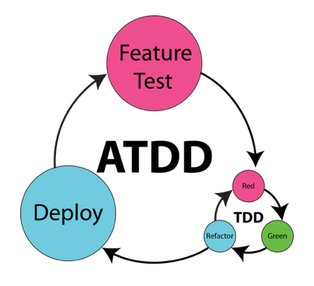
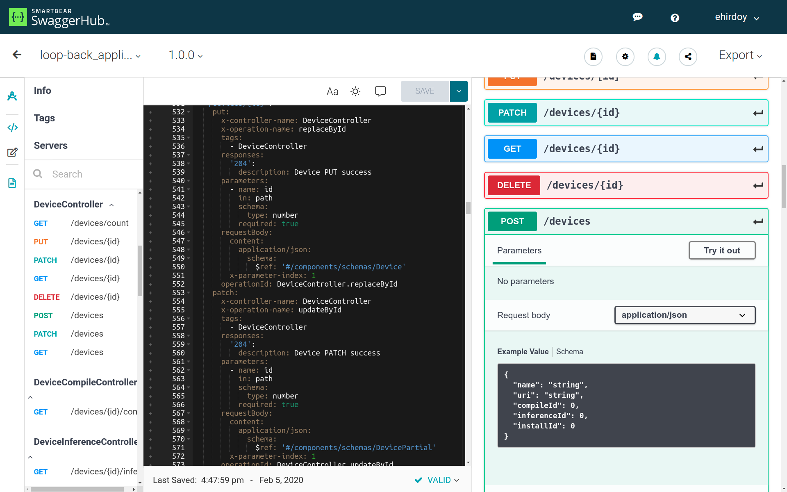
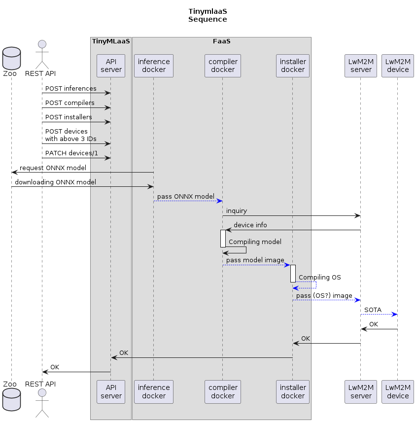
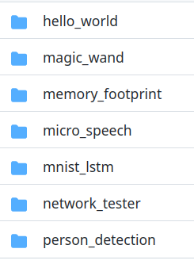
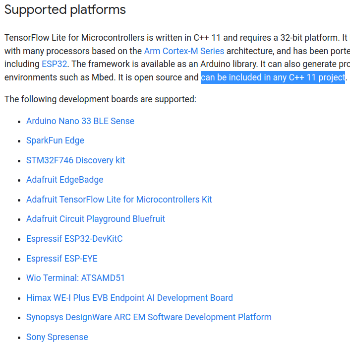
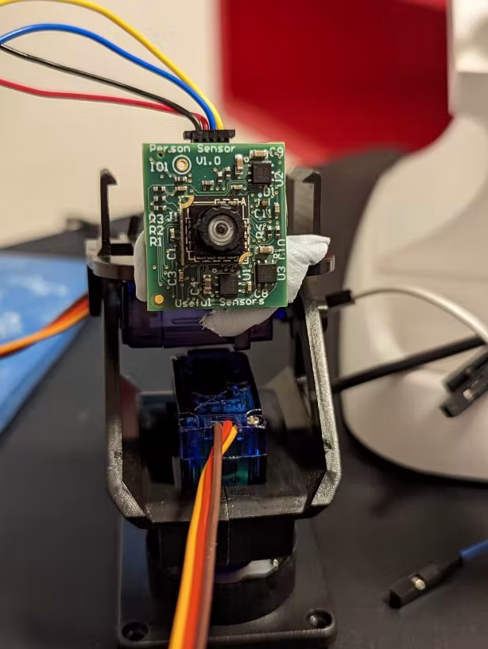

# Project goal
::: columns
:::: {.column width=55%}
_"The main goal of this software engineering project is to develop a solution that enables a seamless **TinyML lifecycle management**.
In particular, the idea is to build a framework that **in an automated fashion** performs the different steps of the TinyML lifecycle management."_

::::
:::: {.column width=45%}
{height=80%}
::::
:::

# Lifecycle of: ML vs TinyML
::: columns
:::: {.column width=50%}
## (Cloud) ML
{height=100%}
::::
:::: {.column width=50%}
## TinyML
{height=80%}
::::
:::

# Arch: Edge ML vs Cloud ML vs TinyML
::: columns
:::: {.column width=30%}
## Edge ML
(Local ML)
{height=100%}
::::
:::: {.column width=30%}
## Cloud ML
{height=100%}
::::
:::: {.column width=40%}
## TinyML
{height=120%}
::::
:::

# CI / CD / ATDD
{height=85%}

The simplest **Test1** can run the [_TFLite micro Hello World_](https://www.tensorflow.org/lite/microcontrollers#explore_the_examples) in a container w/o HW.

# MVP iteration
::: columns
:::: {.column width=65%}
## Always runnable MVP at Day 1
{width=80%}
::::
:::: {.column width=35%}
## Acceptance Test Driven Development
{width=120%}
::::
:::

# Automate with TinyMLaaS API
::: columns
:::: {.column width=60%}
## [OpenAPI](https://www.openapis.org/) spec over simple IoT system
{height=100%}
::::
:::: {.column width=40%}
## Function as-a-Service (FaaS)
{height=100%}
::::
:::
[Streamlit](https://streamlit.io/) vs [Pyscript](https://pyscript.net/)+[API server](https://huggingface.co/docs/api-inference/index) depends on how to demonstrate user story?

# TensorFlow Lite for Microcontrollers[*](https://github.com/tensorflow/tflite-micro/tree/main/tensorflow/lite/micro/examples)
::: columns
:::: {.column width=20%}
## ML model Examples
{height=70%}
::::
:::: {.column width=50%}
{height=90%}
::::
:::: {.column width=30%}
## [Face-Following Pan/Tilt Stand](https://www.hackster.io/petewarden/face-following-pan-tilt-stand-fe5da6)
{height=90%}
::::
:::

# Contact information
## [Origami](#Team)
[https://Origami-TinyML.github.io/blog/about.html](https://Origami-TinyML.github.io/blog/about.html)
