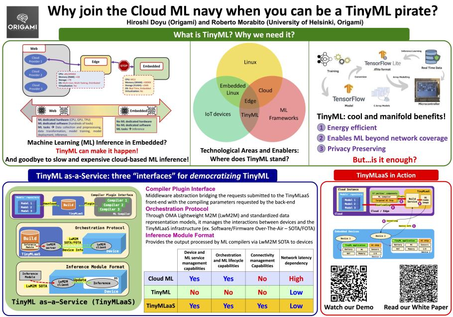

% Seamless TinyML lifecycle management
% [Roberto Morabito](mailto:roberto.morabito@helsinki.fi);[Hiroshi Doyu](mailto:hiroshi.doyu@gmail.com)
% \today

# Background:

The pervasive use of Machine Learning (ML) algorithms, as well as of the enhanced AI processing-enabled software and hardware components led us to think that the traditional cloud-based AI lifecycle can nearly always be the right recipe for ensuring a seamless and efficient AI processing. But is this really the case? The strong dependency on the use of cloud and specialized processing technologies (e.g., GPU) of the modern ML toolchains naturally limits the ML reachability and usability. Edge AI has tried to reduce the dependency from these technologies, by enabling more viable, user-friendly, and out-of-the box AI processing deployments. However, the dependency on connectivity and the lack of 'plug and play' interoperability among different AI-enabled edge devices, negatively counterbalance the benefits generated.

The concept that allows to fit ML models into constrained
devices, without compromising their energy efficiency, is called
Tiny Machine Learning (TinyML). TinyML encompasses very resource-constrained hardware, software, ML algorithms, compilers, and tools to squeeze a ML model into a few kilobyte
of memory. As these hardware platforms, compilers, and software tools are often tied to a specific vendor, the lack of interoperability among different solutions may undermine the other benefits deriving by the use of TinyML. To cope with this issue, we have recently proposed [TinyML as-a-Service (TinyMLaaS)](https://www.researchgate.net/profile/Roberto-Morabito-2/publication/351533707_A_TinyMLaaS_Ecosystem_for_Machine_Learning_in_IoT_Overview_and_Research_Challenges/links/60e5613a92851c2b83e5090e/A-TinyMLaaS-Ecosystem-for-Machine-Learning-in-IoT-Overview-and-Research-Challenges.pdf), a cloud- or edge- based service that simplifies the deployment of ML models into constrained devices and guarantees the desired interoperability.

In the context of the [University of Helsinki Nexus Incubator Program](https://www.helsinki.fi/en/networks/helsinki-incubators/incubators/nexus-deep-tech-ai-sustainability), we established the team, **Origami**, whose goal is to build a software solution around the TinyMLaaS concept.

# Project Proposal:

The main goal of this software engineering project is to develop a solution that enables a seamless **TinyML lifecycle management**. In particular, the idea is to build a framework that **in an automated fashion** performs the different steps of the TinyML lifecycle management.

The different steps can be summarized as follows:
 
1. Data collection
2. Model training
3. Model squeezing for targeting TinyML-enabled devices
4. Model splitting
5. Model deployment 
6. Model update

Below is a brief explanation on how these different steps are supposed to be performed.

### Data collection

For the data collection phase, the students will need to build a software component that allows to gather data from sensors and/or actuators connected to very constrained devices (e.g., Raspberry Pi Nano or similar devices), and then transfer the data to a backend system from [further processing](https://waverleysoftware.com/blog/data-collection-for-machine-learning-guide/) (e.g., labeling).

Please note that, given that this is a students project, we are not aiming to deal with big amount of data. The idea is to make the process feasible in general purpose computing machines.

### Model training

In order to complete this phase, the students will rely on the nowadays largely acknowledged good practices of [ML model training](https://www.dominodatalab.com/blog/what-is-machine-learning-model-training).

### Model squeezing for targeting TinyML-enabled devices

At this stage, there is need to build a component that operates over the model trained in the previous phase, in such a way to squeeze its dimension so as to make it suitable for being used in TinyML-enabled devices. The students can refer to well-known ML frameworks (i.e., TensorFlow) for developing such feature ([Model conversion overview](https://www.tensorflow.org/lite/models/convert), [Build and convert models](https://www.tensorflow.org/lite/microcontrollers/build_convert))

### Model splitting

Giving the resources constraints of some devices and the requirements of certain AI applications, there are cases in which the AI model cannot be squeezed enough to fit in to the targeted TinyML-enabled device. To cope with such limitation, the framework can embed a functionality that optimally splits the original model in multiple parts so as to make fitting part of the model into the constrained device and the remaining part in more capable computing environments.

### Model deployment

The *model deployment* consists in the process of placing a finished machine learning model into a live environment where it can be used for its intended purpose. In the context of the project, the students will develop a feature of the lifecycle management framework that enables the model transfer to a wide set of devices, based on their computing capabilities. In practice, the framework should be able to **identify** the computing capabilities of the platform that will execute the model (e.g., single-board computer, microcontroller, smartphone, etc.) and then **transfer** (via USB, WiFi, or Bluetooth) and **install** a tailor-made version of the trained model (e.g., object detection) according to the hardware/software requirements of the targeted platform.

### Model update

In this final phase of the lifecycle, the goal is to develop a Software Over The Air (SOTA) update feature that allows to seamlessly update a ML model in the targeted TinyML device. The operational dash board could be implemented in the form of SaaS.

# Additional support from the mentors:

Along with the support already planned for this project, the mentors will provide a set of TinyML-enabled devices (e.g., [Raspberry Pi Pico](https://www.raspberrypi.com/products/raspberry-pi-pico/), [Coral Dev Board Micro](https://coral.ai/products/dev-board-micro/), [Arduino Nano 33 BLE Sense](https://docs.arduino.cc/hardware/nano-33-ble-sense)) with which the students can prototype and test the developed solution. Upon request, additional (and more powerful) devices can possibly be provided (e.g., Raspberry Pi 4, NVIDIA Jetson Nano, Coral Dev Board).
